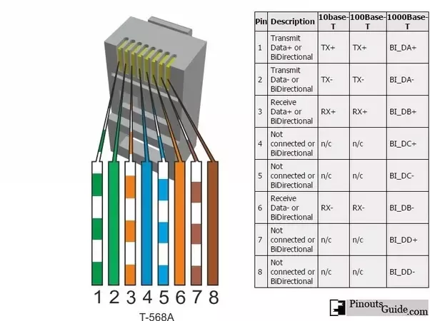

# Laboratório de Cabeamento - 1 Aula

## Objetivos:

Conhecer os padrões mais utilizados para o cabeamento de rede e a confecção de um cabo de rede. Ainda neste laboratório deverão ser configurados todos os equipamentos que compõem o kit de trabalho de cloud computing. 

Pré-requisitos:

* Ethernet . [Tanenbaum - seções 2.2.2 Par trançado, 4.3.1 Cabeamento Ethernet, 4.3.8 Ethernet de gigabit].

## Cloud Computing

O kit contém os seguintes itens:

 * Roteador TP-LINK TL-R470T+
 * Switch DLink DSG-1210-28 de 28 portas
 * 6 hosts

OBS: A senha do roteador está no inventário do seu kit e a do switch está no manual oficial.

{width=600}

## Passo 1 – Cabo de rede (Patch cord)

### O primeiro deste exercício é a confecção do cabo de rede para a conexão de seu computador pessoal ao ambiente do seu kit. O padrão que será utilizado é o ANSI/TIA/EIA 568 que foi desenvolvido em 1991 pela EIA  (Electronics Industries Alliance) e pela TIA (Telecommunications Industry Association), para normatizar as ligações elétricas/eletrônicas de cabos de rede e sua conectorização. Em 1995 uma revisão é publicada a  ANSI/TIA/EIA 568A.

### Iremos utilizar o cat6

{width=600}

Um resumo das diferenças entre as categorias de cabos Ethernet:

* Categoria 4 (Cat 4):

Suporta velocidades de até 16 Mbps.
Pouco comum e geralmente substituído por cabos de categoria superior devido à sua limitada largura de banda.

* Categoria 5 (Cat 5):

Introduziu melhorias significativas na capacidade de transmissão de dados.
Suporta velocidades de até 100 Mbps (Ethernet 100BASE-TX).
Utilizado amplamente para redes Ethernet 100BASE-TX e também para redes de telefonia e vídeo.

* Categoria 5e (Cat 5e):

"E" significa "Enhanced" (Aprimorado).
Melhorias adicionais na capacidade de transmissão e redução da interferência.
Suporta velocidades de até 1 Gbps (Gigabit Ethernet) até 100 metros.

* Categoria 6 (Cat 6):

Oferece melhor desempenho e largura de banda em comparação com Cat 5e.
Suporta velocidades de até 10 Gbps em curtas distâncias (até 55 metros) e até 1 Gbps em distâncias de até 100 metros.
Categoria 6a (Cat 6a):

"A" significa "Augmented" (Aumentado).
Melhorias adicionais na capacidade de transmissão e redução da interferência em comparação com Cat 6.
Suporta velocidades de até 10 Gbps em distâncias de até 100 metros.

* Categoria 7 (Cat 7):

Introduzido para suportar o padrão 10GBASE-T.
Oferece maior largura de banda e imunidade a interferências.
Suporta velocidades de até 10 Gbps em distâncias de até 100 metros.

* Categoria 8 (Cat 8):

Projetado para atender às demandas de redes de alta velocidade, como data centers e backbone de rede.
Suporta velocidades de até 40 Gbps e 100 Gbps em curtas distâncias (até 30 metros).

{width=600}

O protocolo Ethernet é um dos protocolos mais comuns e amplamente utilizados em redes de computadores. Ele define as regras para a comunicação de dados entre dispositivos em uma rede local (LAN - Local Area Network).

Aqui estão alguns pontos-chave sobre o protocolo Ethernet:

Meio de Transmissão: O Ethernet pode ser usado em diferentes tipos de mídia de transmissão, incluindo cabos de cobre (como o Ethernet de par trançado) e fibra óptica. Isso proporciona flexibilidade na implementação de redes Ethernet em diversos ambientes.

Quadro Ethernet: Os dados são transmitidos em unidades chamadas de "quadros Ethernet". Cada quadro possui um cabeçalho e um trailer, além dos dados propriamente ditos. O cabeçalho contém informações importantes, como endereços MAC de origem e destino, tipo de protocolo e verificação de erros.

Endereços MAC: Cada dispositivo em uma rede Ethernet possui um endereço MAC (Media Access Control) único, que é gravado na placa de rede do dispositivo. Esses endereços são utilizados para identificar os dispositivos na rede e determinar para qual dispositivo os quadros Ethernet são destinados.

Acesso ao Meio: O protocolo Ethernet utiliza um método de acesso ao meio chamado CSMA/CD (Carrier Sense Multiple Access with Collision Detection). Isso significa que os dispositivos verificam o meio de transmissão para detectar a presença de sinais de outros dispositivos antes de iniciar a transmissão. Se ocorrer uma colisão (ou seja, dois dispositivos tentam transmitir simultaneamente), o CSMA/CD é usado para lidar com a situação e tentar retransmitir os dados de forma eficiente.

Padrões Ethernet: O Ethernet evoluiu ao longo do tempo, com diferentes padrões que especificam velocidades de transmissão de dados, tipos de cabos, e outras características. Alguns dos padrões mais comuns incluem Ethernet de 10 Mbps (10BASE-T), Fast Ethernet de 100 Mbps (100BASE-TX), Gigabit Ethernet de 1 Gbps (1000BASE-T), e 10 Gigabit Ethernet de 10 Gbps (10GBASE-T).

{width=600}

## Lapidando o projeto

## Antes de iniciar você deve **"resetar"** o switch e o roteador do seu KIT !!!!!!!

Agora com o cabo que você acabou de fazer, realize as seguinte modificações (se preciso, leia os manuais):
Lembre-se da aula teorica, com um certo nivel de abstracão, dispositivos so se comunicão se estiverem na mesma rede.

  * Altere o IP do Roteador para 172.16.0.1/20.
  * Altere o IP do Switch para 172.16.0.2/20.

## Passo 2 – conexão dos hosts e roteador
  

{width=600}

* De Acordo com a imagem da topologia (primeira imagem), conecte os cabos de rede presentes em seu kit no switch, hosts e roteador;
* Utilize o **cabo que você montou** para interligar o seu notebook com o kit (conecte ele no switch);