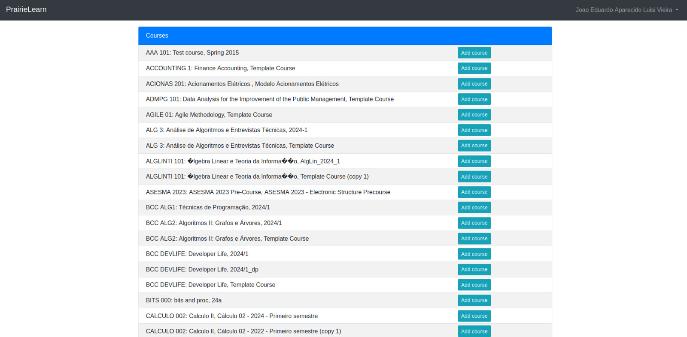
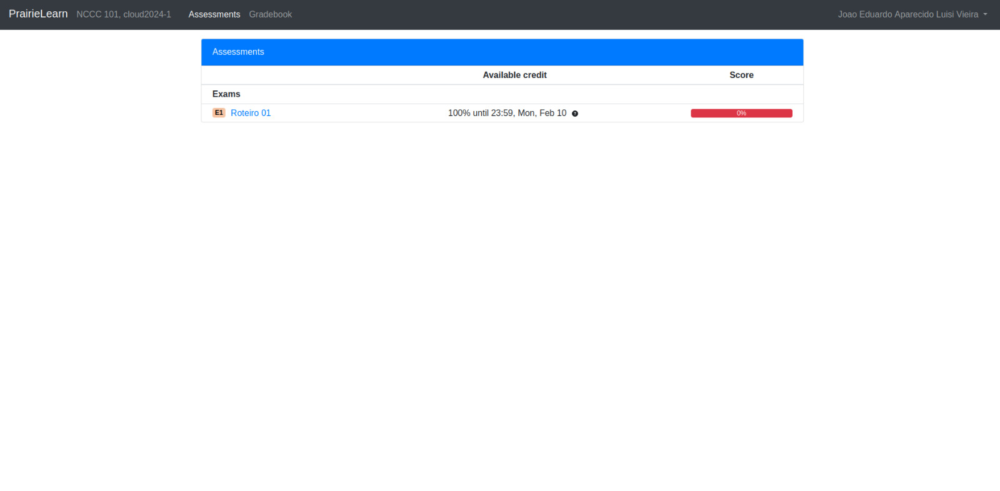
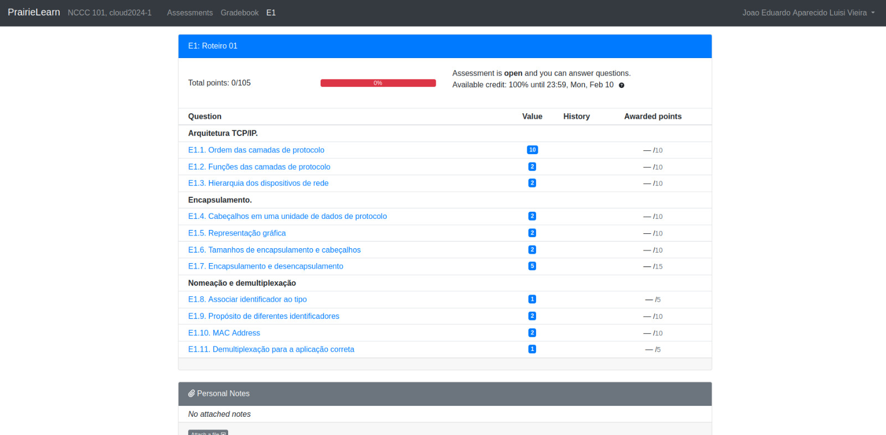

# Bare Metal

## Objetivos:

* Entender os conceitos básicos sobre uma plataforma de gerenciamento de hardware.
* Introduzir conceitos básicos sobre redes de computadores.

Pré-requisitos:

* Realizar a leitura sobre o MaaS. [https://maas.io/].
<!-- * Realizar a leitura sobre redes de computadores. [Tanenbaum - seções 1.4, 4.0 e 5.6] -->


??? info 
    **DIVISÃO DO ROTEIRO** 
    
    O Roteiro é dividido em 2 partes principais.
    
    * Criando a Infraestrutura (Nuvem Bare-metal)
    * Usando a infraestrutura: Django em Nuvem Bare-Metal


## Material

O grupo irá contar com os seguintes itens no kit:

  * 1 NUC (main) com 10Gb e 1 SSD (120Gb)
  * 1 NUC (server1) com 12Gb e 1 SSD (120Gb)
  * 1 NUC (server2) com 16Gb e 2 SSD (120Gb+120Gb)
  * 3 NUCs (server3, server4 e server5) com 32Gb e 2 SSD (120Gb+120Gb)
  * 1 Switch DLink DSG-1210-28 de 24 portas
  * 1 Roteador TP-Link TL-R470T+

### Rede

Atencao as modificacoes necessárias apresentadas nos requisitos de projeto citados abaixo, modifique o que for necessário.

Cada grupo tem a disposição um ponto de rede (cabo preto) com saída para a rede interna da faculdade.


### **Tarefa:** Confirme se as conexões de rede feitas anteriormente estão corretas. Utilize o diagrama fornecido no roteiro de cabeamento e as informacoes acima.

Cada kit possui um IP de entrada, verifique no dashboard do roteador.


### Senhas - IMPORTANTE

**Todas as senhas do seu sistema devem seguir o seguinte critério:**

  * utilizar a palavra 'cloud' + a letra do kit minúscula.
  * Por exemplo: 'cloudz' é a senha padrão do kit Z.
  * Usar a mesma senha para **todos** os serviços que exigem cadastramento
  * **NÃO** alterar nenhuma senha que já esteja pré-cadastrada.


# **Criando a Infraestrutura (Nuvem Bare-metal)**

* Consulte o diagrama abaixo "H1 - Diagrama" as setas laranjas representam a "Bridge" que será implantado nos próximos passos.

{width=600}

### Instalando o Ubuntu

Procure tutoriais de como instalar o Sistema Operacional **Ubuntu server**, utilize um pen drive para baixar a imagem e criar um pendrive para boot da instalacao.

  * Instale o Ubuntu Server 22.04 LTS na NUC main:
    * hostname: main
    * login: cloud
    * senha: (cloud + letra do kit)
    * IP fixo: **172.16.0.3**
    * Server name: **172.20.129.131**

### Instalando o MaaS

  * O MAAS possui diversas versões, iremos utilizar a "stable" 3.5.3 [link para visualizar o time line](https://launchpad.net/maas/+series)
  * Verifique se consegue pingar '8.8.8.8'. Se não conseguir, descubra como rotear os pacotes corretamente.
  * Verifique se consegue pingar 'www.google.com'. Se não conseguir, descubra como resolver as urls corretamente.
  * ```$ sudo apt update && sudo apt upgrade -y```
  
  * ```$ sudo snap install maas --channel=3.5.3/stable```

  * ```$ sudo snap install maas-test-db```

### Acessando sua maquina remotamente.

### Faça o acesso utilizando SSH

### Dentro da rede Local

```ssh cloud@172.16.0.3```


### Configurando o MaaS

  * Inicializando o MaaS:
    * ```$ sudo maas init region+rack --maas-url http://172.16.0.3:5240/MAAS --database-uri maas-test-db:///```
    * ```$ sudo maas createadmin```
      * use o login **cloud**
      * use a senha padrão da disciplina
      * deixe a chave vazia
  * Gerando um par de chaves para autenticação.
    * ```$ ssh-keygen -t rsa```
    * use senha vazia dessa vez
    * ```$ cat ./.ssh/id_rsa.pub```
    * copie a chave gerada
  * Agora vamos acessar o Dashboard do MaaS: 
    * ele estará disponível em http://172.16.0.3:5240/MAAS.
    * Entenda onde o serviço esta rodando e faça o login
    * configure um DNS Forwarder com o DNS do Insper (DNS Externo que o seu roteador enxerga).
    * Importe as imagens do **Ubuntu 22.04LTS e Ubuntu 20.04 LTS**.
    * Faça o *upload* da chave copiada no terminal SSH.
    * Em Settings | General:
      * Global Kernel Parameters: **net.ifnames=0** (sem espaços)

#### Chaveando o DHCP

  * Explore as configurações do MaaS. Habilite o DHCP na subrede pelo MaaS Controller, **ALTERE** o Reserved Range para **iniciar** em 172.16.11.1 e **acabar** em 172.16.14.255.
  * Deixe o DNS da subnet apontando para o DNS do Insper!
  * Desabilitar o DHCP no roteador.

#### Checando a saúde do MAAS

Confirme a saúde do sistema MAAS visitando a página Controladores na interface web (dashboard). Selecione o nome do controlador e certifique-se de que a página resultante mostre uma marca de seleção verde ao lado dos itens 'regiond' até 'dhcpd':


<!-- ### Configurando o Intel AMT
Antes de começar a trabalhar nos servidores temos que configurar o IP do Intel AMT para que o MaaS possa se comunicar com estes mesmo que estejam desligados. Siga os próximos passos para configurar corretamente o IP dos 5 servidores **(exceto o MAIN)**

  *server1 = 172.16.15.1

  *server2 = 172.16.15.2
  
  *server3 = 172.16.15.3
  
  *server4 = 172.16.15.4
  
  *server5 = 172.16.15.5
  
  * Conecte um monitor e um teclado no servidor.
  * Em seguida ligue-o e pressione continuamente as teclas `CTRL` + `P` até que a seguinte tela apareça:

  {width=600}
  
  * Insira a senha que esta no inventário, disponível na aba de troca de arquivos de seu grupo na página da disciplina no BlackBoard.  
  * Siga os menus selecionados nas imagens para chegar no menu de configuração de rede do Intel AMT:

  {width=600}

  {width=600}

  {width=600}

  {width=600}

  * altere os endereços do IPv4, gateway para que correspondam com a sub-rede criada previamente e **defina o DNS preferencial como 0.0.0.0**. No final os valores devem ficar parecidos com os da imagem abaixo:
   
  {width=600}

  * reinicie a sua máquina e cheque se seu MaaS já começou a configura-las na aba "Machines", pode deletá-las já que você fara isso na próxima etapa. -->

#### Comissionando servidores

Cadastre os hosts (machines) disponíveis, server1 ate server5

  * Altere a opção **Power Type** para **Intel AMT** e preencha segundo as informacoes abaixo:
    1. MacAddress que voce anotou (Se nao anotou, desmonta os cabos e faz tudo de novo!!!)
    2. A senha é = CloudComp6s!
    3. IP do AMT = 172.16.15.X (sendo X o id do server, por exemplo server1 = 172.16.15.1) 
  * As NUCs irão comissionar automaticamente, realizando o boot via PXE na rede.
  * **hora do Chá**, só aliviar o estômago um pouco. Chá também tem cafeína.
  * Todos os nós devem aparecer com o status **Ready**. Verificar se as características de hardware (cpu, memória, SSD e rede) foram detectados com sucesso.
  * Adicionar o Roteador como devices no Dashboard do MaaS


#### Criando OVS bridge (ATENÇÃO!!!)

Uma Open vSwitch (OVS) bridge reduz a necessidade de duas interfaces de rede físicas. 

As pontes OVS são criadas na aba Rede na página de configuração de um nó. Aqui, vamos criar uma ponte a partir da interface regular 'enp1s0':

{width=600}

O nome da ponte será referenciado em outras partes dos roteiros. Chame-a de ‘br-ex’.

{width=600}

Múltiplas VLANs podem ser adicionadas à ponte, mas neste exemplo de nuvem, uma única VLAN não etiquetada é usada.

Configure todos os cinco nós de nuvem desta maneira para garantir que o OVN Chassis possa ser acomodado por qualquer nó.


<!-- !!! exercise
    QUESTOES-3

    1. Por que Desabilitar o DHCP do roteador?
    1. Descreva o processo PXE Boot? Qual a sua grande vantagem em um datacenter real?
    1. Analisando em um aspecto mais amplo, quais outras funcionalidades do MaaS podem ser úteis no gerenciamento de **bare metal**?  -->


## Fazendo Acesso Remoto ao seu KIT

De acordo com as aulas teóricas, vamos realizar um **NAT** para permitir o acesso externo **"Rede Wi-fi Insper"** do seu computador ao servidor **MAIN**.

A **meta** é conseguir conectar no servidor principal **"main"** utilizando a porta 22.

Libere tambem o acesso ao gerenciamento remoto do seu roteador criando uma regra de gestão para a rede 0.0.0.0/0

Se não lembrar das aulas teóricas, pesquise por como fazer NAT no Roteador do seu KIT. 

[LINK-documentacao](https://www.tp-link.com/br/support/download/tl-r470t+)


# **Usando a infraestrutura:** 
## Django em Nuvem Bare-Metal

### Primeiro Deploy

Vamos realizar um deploy manual de uma aplicação simples em Django em nossa nuvem MaaS.

Antes de começar, realize um pequeno ajuste no DNS server:

* Dentro da aba Subnets, clicar na subnet 172.16.0.0/20 e editar a Subnet summary colocando o DNS do Insper - 172.20.129.131

### Primeira parte: Banco de Dados

Postgres é um servidor de banco de dados versátil e de fácil manejo. Muito usado em projetos Opensource.

* Acesse o Dashboard do MaaS e realize o deploy do Ubuntu 22.04 no server1.
* Acesse o terminal do server1 via SSH:
  * ```$ sudo apt update```
  * ```$ sudo apt install postgresql postgresql-contrib -y```
* Ainda no terminal do server1, crie agora um usuário para a aplicação:
  * ```$ sudo su - postgres```
  * ```$ createuser -s cloud -W```
  * Usar a senha: cloud
* Crie um database para a aplicação:
  * ```$ createdb -O cloud tasks```
* Exponha o serviço para acesso:
  * ```$ nano /etc/postgresql/14/main/postgresql.conf```
  * Remova o comentário e substitua a string da linha para aceitar conexões remotas:
```
  listen_addresses = '*'
```
  * ```$ nano /etc/postgresql/<versão>/main/pg_hba.conf```
  * Adicione a linha que libera qualquer máquina dentro da subnet do kit:
```
  host    all             all             172.16.0.0/20          trust
```
* Saia do usuário postgres
* Libere o firewall:
  * ```$ sudo ufw allow 5432/tcp```
* Reinicie o serviço:
  * ```$ sudo systemctl restart postgresql```

!!! exercise
    CheckPoint-1

    Estude os comandos ping, ifconfig, systemctl, telnet, ufw curl, wget e journalctl. Com estes comandos apresente prints das Telas  que provam que o banco de dados está:
    
        1. Funcionando e seu Status está como "Ativo" para o Sistema Operacional
        1. Acessivel na propria maquina na qual ele foi implantado.
        1. Acessivel a partir de uma conexão vinda da maquina MAIN.
        1. Em qual porta este serviço está funcionando.


### Parte II: Aplicação Django

De volta ao maas, vamos subir uma aplicação ORM Django pré produzida. No lugar de [login], utilize o usuário criado para administrar o MaaS.

* Peça uma máquina direto do cli no terminal agora:
  * ```$ maas login [login] http://172.16.0.3:5240/MAAS/```
  * Buscar o token no dashboard dentro das configurações do usuário.
* Solicite a reserva da máquina para o MaaS:
  * ```$ maas [login] machines allocate name=server2```
  * Anote o campo system_id do json resultante.
* Realize o deploy via linha de comando, usando o cli:
  * ```$ maas [login] machine deploy [system_id]```
* No SSH do server2:
  * ```$ git clone https://github.com/raulikeda/tasks.git```
  * Entre no diretorio tasks.
  * ```$ ./install.sh```
  * reboot e aguarde
* Teste acessando o serviço na porta 8080 no terminal do maas:
  * ```$ wget http://[IP server2]:8080/admin/```

Para acessar o serviço no seu browser seria necessário fazer um NAT no roteador. Porém podemos considerar utilizar um **TUNEL SSH**, com esse serviço temporário podemos expor o serviço para fora do kit enquanto o terminal que o tunnel estiver utilizando esteja ativo:

* Desconecte do SSH do maas
* Reconecte novamente usando:
  * ```$ ssh cloud@10.103.0.X -L 8001:[IP server2]:8080```
* O comando acima irá criar um tunel do serviço do server2 na porta 8080 para o seu localhost na porta 8001 usando a conexão SSH.
* Note que é importante que a porta 8001 não esteja sendo usada no seu computado.
* Acesse então o endereço no browser: http://localhost:8001/admin/
  * Login Django: cloud
  * Senha Django: cloud

Tome um tempo olhando o conteúdo do arquivo install.sh. Ele automatiza as tarefas de instalação usando shell script.

Note que a utilização do maas-cli no terminal substitui a utilização do dashboard. Tome um tempo explorando:

  * ```$ maas [login] help commands```

Caso tenha interesse na aplicação django: https://docs.djangoproject.com/pt-br/3.1/intro/tutorial01/


!!! exercise
    CheckPoint-2

    De um print das Telas abaixo:
    
        1. Do Dashboard do **MAAS** com as máquinas.
        1. Da aba images, com as imagens sincronizadas.
        1. Da Aba de cada maquina(5x) mostrando os testes de hardware e commissioning com Status "OK"
      
## Utilizando o Ansible - deploy automatizado de aplicação

!!! exercise
    Checkpoint-3:

    1. De um print da tela do Dashboard do MAAS com as 2 Maquinas e seus respectivos IPs.
    1. De um print da aplicacao Django, provando que voce está conectado ao server 
    1. Explique como foi feita a implementacao manual da aplicacao Django e banco de dados.

Antes tinhamos 1 aplicação Django, agora teremos 2 aplicações django (server2 e server3) **compartilhando o mesmo banco de dados (server1)**.
Os motivos para fazermos isso são dois:

* Alta disponibilidade: se um node cair o outro está no ar, para que nosso cliente acesse.
* Load Balancing: podemos dividir a carga de acesso entre os nós.

Vamos realizar a instalação da mesma aplicação de forma automática, por exemplo **podemos efetuar a instalação em diversos servers**. Vamos então utilizar novos conceitos e ferramentas: Exemplo - gerenciador de deploy Ansible (<https://www.ansible.com/>)

Características:

* Idempotente no sentido de conseguir repetir todos os procedimentos sem afetar os estados intermediários da instação.
* Fácil de se lidar com um pool de máquinas simultaneamente.
* Consegue realizar o provisionamento automático de VMs e Containers (mas não metal).

Tarefas:

* Peça o deploy no server3 para o maas via cli
* Agora no SSH do main:
  * \$ sudo apt install ansible
  * \$ wget <https://raw.githubusercontent.com/raulikeda/tasks/master/tasks-install-playbook.yaml>
  * \$ ansible-playbook tasks-install-playbook.yaml -\-extra-vars server=[IP server3]

!!! exercise
    Checkpoint-4:

    Teste o acesso, caso esteja tudo certo, faça a tarefa abaixo
    
        1. De um print da tela do Dashboard do MAAS com as 3 Maquinas e seus respectivos IPs.
        1. De um print da aplicacao Django, provando que voce está conectado ao server2 
        1. De um print da aplicacao Django, provando que voce está conectado ao server3 
        1. Explique qual diferenca entre instalar manualmente a aplicacao Django e utilizando o Ansible.

Contudo seria ideal que tivéssemos apenas um ponto de entrada, ao invés de escolher manualmente ou chavear os IPs dos nós.

## Balancamento de carga usando Proxy Reverso

Para montar o ponto único de entrada, utilizaremos uma aplicação de proxy reverso como load balancer.

Vocês conseguem instalar o NGINX no nó server4 como loadbalancer? ... **Então monte este proxy**.

* Tutorial para fazer manual: <https://www.digitalocean.com/community/tutorials/how-to-set-up-nginx-load-balancing>

??? DICAS
    Loadbalancing é um mecanismo útil para distribuir o tráfego de entrada por vários servidores privados virtuais capazes. Ao distribuir o mecanismo de processamento por várias máquinas, a redundância é fornecida à aplicação - garantindo tolerância a falhas e maior estabilidade. O algoritmo Round Robin para balanceamento de carga envia visitantes para um conjunto de IPs. Em seu nível mais básico, o Round Robin, que é relativamente fácil de implementar, distribui a carga do servidor sem considerar fatores mais matizados como o tempo de resposta do servidor e a região geográfica dos visitantes.

    Configuração:
      Antes de configurar o loadbalancing do nginx, você deve ter o nginx instalado no seu VPS. Você pode instalá-lo rapidamente com o apt-get:

      $ sudo apt-get install nginx

    Módulo Upstream

      Para configurar um loadbalancer round robin, precisaremos usar o módulo upstream do nginx. Incorporaremos a configuração nas definições do nginx.

      Prossiga e abra a configuração do seu site (neste exemplo, trabalharei com o host virtual padrão genérico):

       $ sudo nano /etc/nginx/sites-available/default

      Precisamos adicionar a configuração de balanceamento de carga ao arquivo.

      Primeiro, precisamos incluir o módulo upstream, que se parece com isto:

       upstream backend { server backend1.exemplo.com; server backend2.exemplo.com; server backend3.exemplo.com; }

      Depois, devemos referenciar o módulo mais adiante na configuração:

       server { location / { proxy_pass http://backend; } }

      Reinicie o nginx:

       $ sudo service nginx restart

      Contanto que você tenha todos os servidores privados virtuais no lugar, agora você deve encontrar que o balanceador de carga começará a distribuir os visitantes igualmente para os servidores vinculados.

??? DICAS
    No arquivo de tasks/views.py de cada Django modifique a mensagem "Hello World ..." para conseguir identificar cada server (coloque uma mensagem diferente em cada)

      Código:

        from django.shortcuts import render

        from django.http import HttpResponse

        def index(request):
        
          return HttpResponse("Hello, world. You're at the tasks index.")


    No arquivo de urls.py customize o seu path no urlpatterns:

      urlpatterns = [path( '  ', views.index, name='index'),]

!!! exercise
    Checkpoint-5:

    Teste o acesso, caso esteja tudo certo, faça a tarefa abaixo:
        1. De um print da tela do Dashboard do MAAS com as 4 Maquinas e seus respectivos IPs.
        1. Altere o conteúdo da mensagem contida na função `index` do arquivo `tasks/views.py` de cada server para distinguir ambos os servers. 
        1. Faça um `GET request` para o path que voce criou em urls.py para o Nginx e tire 2 prints das respostas de cada request, provando que voce está conectado ao server 4, que é o Proxy Reverso e que ele bate cada vez em um server diferente server2 e server3.  


#### Agora que você utilizou um gerenciador de deploy, vamos retormar a criação de nuvem utilizando este novo conceito.!!!!

**Remova o deploy (release) de todos nós no kit.**

## Finalizando

Entre no Site e responda as questoes da plataforma PrairieLearn, você deve fazer no minimo de 70 pontos e pedir para fazer a arguição para considerar entregue este roteiro 1.

[LINK da plataforma de questões](https://us.prairielearn.com/pl)

Acessar com seu usuário de login do INSPER. **e-mail institucional**

As imagens abaixo são da plataforma.

* Clicar em Enroll Course
* Procurar o Curso -> NCCC 101: Network concepts for cloud construction
* versão 25a-cloud
* Se cadastrar. 
* Responder as questões


{width=600}


{width=600}


{width=600}


<!-- !!! exercise
    QUESTOES-4

    1. O que é e como funciona o NAT? 
    1. O que significa LTS? Por que isso importa para uma empresa?
    1. O que é IPv6? Qual a importância da migração?
    1. A literatura preconiza que o Modelo de Rede Internet possui 4 camadas, quais são elas e quais camadas foram envolvidas nesse capítulo?
    1. A literatura mais antiga discorre sobre o Modelo de Rede OSI de 7 camadas. Explique a diferença entre os dois modelos.
    1. O que é um MAC address?
    1. O que é um IP address? Como ele difere do MAC address?
    1. O que é CIDR? Qual o papel da subrede? 
    1. O que são DHCP, DNS e gateway?
 -->

## **Conclusão:** *SOMENTE PARA PENSAR* 

```

 Descreva como o MaaS poderia ser utilizado em um datacenter real (com muitos servidores) e como seria um processo alternativo sem essa ferramenta. Ainda, é possível e *SIMPLES* realizar a implantação de uma aplicação usando o MaaS?

```
