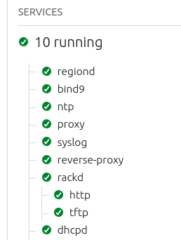

# Bare Metal


# **Criando a Infraestrutura (Nuvem Bare-metal)**

* Consulte o diagrama abaixo "H1 - Diagrama" as setas laranjas representam a "Bridge" que será implantado nos próximos passos.

{width=600}

### Instalando o Ubuntu

Procure tutoriais de como instalar o Sistema Operacional **Ubuntu server**, utilize um pen drive para baixar a imagem e criar um pendrive para boot da instalacao.

  * Instale o Ubuntu Server 22.04 LTS na NUC main:
    * hostname: main
    * login: cloud
    * senha: (cloud + letra do kit)
    * IP fixo: **172.16.0.3**
    * Server name: **172.20.129.131**

### Instalando o MaaS

  * O MAAS possui diversas versões, iremos utilizar a "stable" 3.5.3 [link para visualizar o time line](https://launchpad.net/maas/+series)
  * Verifique se consegue pingar '8.8.8.8'. Se não conseguir, descubra como rotear os pacotes corretamente.
  * Verifique se consegue pingar 'www.google.com'. Se não conseguir, descubra como resolver as urls corretamente.
  * ```$ sudo apt update && sudo apt upgrade -y```
  
  * ```$ sudo snap install maas --channel=3.5.3/stable```

  * ```$ sudo snap install maas-test-db```

### Acessando sua maquina remotamente.

### Faça o acesso utilizando SSH

### Dentro da rede Local

```ssh cloud@172.16.0.3```


### Configurando o MaaS

  * Inicializando o MaaS:
    * ```$ sudo maas init region+rack --maas-url http://172.16.0.3:5240/MAAS --database-uri maas-test-db:///```
    * ```$ sudo maas createadmin```
      * use o login **cloud**
      * use a senha padrão da disciplina
      * deixe a chave vazia
  * Gerando um par de chaves para autenticação.
    * ```$ ssh-keygen -t rsa```
    * use senha vazia dessa vez
    * ```$ cat ./.ssh/id_rsa.pub```
    * copie a chave gerada
  * Agora vamos acessar o Dashboard do MaaS: 
    * ele estará disponível em http://172.16.0.3:5240/MAAS.
    * Entenda onde o serviço esta rodando e faça o login
    * configure um DNS Forwarder com o DNS do Insper (DNS Externo que o seu roteador enxerga).
    * Importe as imagens do **Ubuntu 22.04LTS e Ubuntu 20.04 LTS**.
    * Faça o *upload* da chave copiada no terminal SSH.
    * Em Settings | General:
      * Global Kernel Parameters: **net.ifnames=0** (sem espaços)

#### Chaveando o DHCP

  * Explore as configurações do MaaS. Habilite o DHCP na subrede pelo MaaS Controller, **ALTERE** o Reserved Range para **iniciar** em 172.16.11.1 e **acabar** em 172.16.14.255.
  * Deixe o DNS da subnet apontando para o DNS do Insper!
  * Desabilitar o DHCP no roteador.

#### Checando a saúde do MAAS

Confirme a saúde do sistema MAAS visitando a página Controladores na interface web (dashboard). Selecione o nome do controlador e certifique-se de que a página resultante mostre uma marca de seleção verde ao lado dos itens 'regiond' até 'dhcpd':




<!-- ### Configurando o Intel AMT
Antes de começar a trabalhar nos servidores temos que configurar o IP do Intel AMT para que o MaaS possa se comunicar com estes mesmo que estejam desligados. Siga os próximos passos para configurar corretamente o IP dos 5 servidores **(exceto o MAIN)**

  *server1 = 172.16.15.1

  *server2 = 172.16.15.2
  
  *server3 = 172.16.15.3
  
  *server4 = 172.16.15.4
  
  *server5 = 172.16.15.5
  
  * Conecte um monitor e um teclado no servidor.
  * Em seguida ligue-o e pressione continuamente as teclas `CTRL` + `P` até que a seguinte tela apareça:

  {width=600}
  
  * Insira a senha que esta no inventário, disponível na aba de troca de arquivos de seu grupo na página da disciplina no BlackBoard.  
  * Siga os menus selecionados nas imagens para chegar no menu de configuração de rede do Intel AMT:

  {width=600}

  {width=600}

  {width=600}

  {width=600}

  * altere os endereços do IPv4, gateway para que correspondam com a sub-rede criada previamente e **defina o DNS preferencial como 0.0.0.0**. No final os valores devem ficar parecidos com os da imagem abaixo:
   
  {width=600}

  * reinicie a sua máquina e cheque se seu MaaS já começou a configura-las na aba "Machines", pode deletá-las já que você fara isso na próxima etapa. -->

#### Comissionando servidores

Cadastre os hosts (machines) disponíveis, server1 ate server5

  * Altere a opção **Power Type** para **Intel AMT** e preencha segundo as informacoes abaixo:
    1. MacAddress que voce anotou (Se nao anotou, desmonta os cabos e faz tudo de novo!!!)
    2. A senha é = CloudComp6s!
    3. IP do AMT = 172.16.15.X (sendo X o id do server, por exemplo server1 = 172.16.15.1) 
  * As NUCs irão comissionar automaticamente, realizando o boot via PXE na rede.
  * **hora do Chá**, só aliviar o estômago um pouco. Chá também tem cafeína.
  * Todos os nós devem aparecer com o status **Ready**. Verificar se as características de hardware (cpu, memória, SSD e rede) foram detectados com sucesso.
  * Adicionar o Roteador como devices no Dashboard do MaaS


#### Criando OVS bridge (ATENÇÃO!!!)

Uma Open vSwitch (OVS) bridge reduz a necessidade de duas interfaces de rede físicas. 

As pontes OVS são criadas na aba Rede na página de configuração de um nó. Aqui, vamos criar uma ponte a partir da interface regular 'enp1s0':

{width=600}

O nome da ponte será referenciado em outras partes dos roteiros. Chame-a de ‘br-ex’.

{width=600}

Múltiplas VLANs podem ser adicionadas à ponte, mas neste exemplo de nuvem, uma única VLAN não etiquetada é usada.

Configure todos os cinco nós de nuvem desta maneira para garantir que o OVN Chassis possa ser acomodado por qualquer nó.


<!-- !!! exercise
    QUESTOES-3

    1. Por que Desabilitar o DHCP do roteador?
    1. Descreva o processo PXE Boot? Qual a sua grande vantagem em um datacenter real?
    1. Analisando em um aspecto mais amplo, quais outras funcionalidades do MaaS podem ser úteis no gerenciamento de **bare metal**?  -->


## Fazendo Acesso Remoto ao seu KIT

De acordo com as aulas teóricas, vamos realizar um **NAT** para permitir o acesso externo **"Rede Wi-fi Insper"** do seu computador ao servidor **MAIN**.

A **meta** é conseguir conectar no servidor principal **"main"** utilizando a porta 22.

Libere tambem o acesso ao gerenciamento remoto do seu roteador criando uma regra de gestão para a rede 0.0.0.0/0

Se não lembrar das aulas teóricas, pesquise por como fazer NAT no Roteador do seu KIT. 

[LINK-documentacao](https://www.tp-link.com/br/support/download/tl-r470t+)


