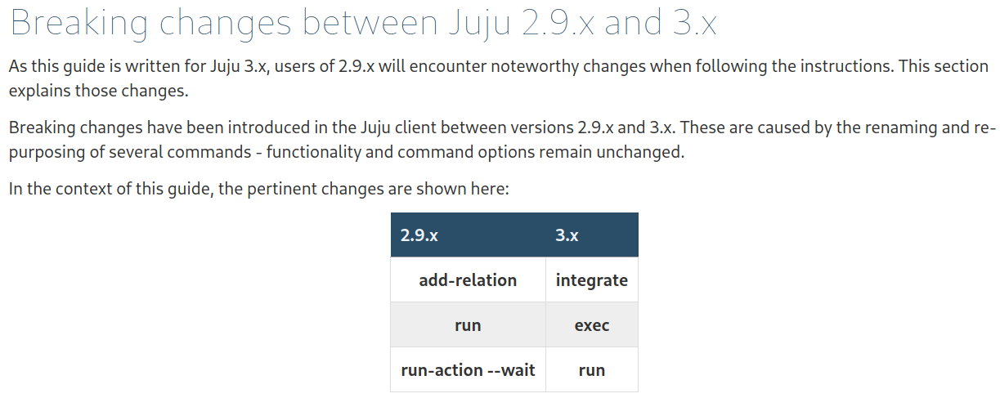

# Deployment Orchestration


## Criando Infraestrutura para deploy com Juju

*Ansible é um gerenciador de deploy que consegue lidar com a instalação e configuração de um conjunto de nós pré reservados, mas não consegue realizar o provisionamento direto com o MaaS (gerenciador de Bare-metal). Para montar a nossa Cloud Privada, vamos utilizar outro orquestrador de deploy que integra com o MaaS.*

* Antes de continuar, verifique se todas máquinas (server1, server2, server3, server4 e server5) estão Ready no MAAS. Faça o release das máquinas Django e Postgres caso necessário.
* Acesse o main via SSH e instale o Juju
  * \$ sudo snap install juju --channel 3.6


{width=800}  

* Verifique se o Juju enxerga o MaaS como um provedor de recursos, caso o MAAS não esteja como provider do JUJU, adicione ele.
  * \$ juju clouds

  *Adicione o cluster MAAS para que o Juju possa gerenciá-lo como uma cloud, o JUJU irá utilizar o MAAS como seu provedor de máquinas e Sistema Operacional. Vamos fazer isso através de um arquivo de definição de cloud, como maas-cloud.yaml:*

* Caso não possua o MaaS como opção, deve adicioná-lo, **confirme se o arquivo corresponde com o seu ambiente !!!!!**
  * Criar um arquivo de configuração: maas-cloud.yaml (atenção com a formatação)
  ```
    clouds:
      maas-one:
        type: maas
        auth-types: [oauth1]
        endpoint: http://192.168.0.3:5240/MAAS/
  ```

  * \$ juju add-cloud --client -f maas-cloud.yaml maas-one

  *Adicione as credenciais MAAS para que o Juju possa interagir com a nova cloud adicionada. Vamos novamente usar um arquivo para importar nossas informações, como maas-creds.yaml:*

  ```
  credentials:
    maas-one:
    anyuser:
      auth-type: oauth1
      maas-oauth: <API KEY>
  ```

  * \$ juju add-credential --client -f maas-creds.yaml maas-one
  * Obs: OAuth é o **API KEY** gerado no MaaS (dentro do menu do usuário)

*Crie o controlador (usando a série ‘jammy’) para a cloud ‘maas-one’ e chame-o de ‘maas-controller’:* **Iremos criar o controlador no server1** para isso faça a tag da maquina com o nome juju através do dashboard MAAS na maquina server1.

* \$ juju bootstrap --bootstrap-series=jammy --constraints tags=juju maas-one maas-controller

Este comando acima irá demorar para finalizar, enquanto isso tente entender porque !!!!!


* Para verificar o status do **controller** utilize:
  * \$ juju status

O Juju necessita de uma máquina exclusiva para controlar todo o deploy. Essa máquina é alocada automaticamente durante o **bootstrap** e controlará todo o deploy que faremos no próximo roteiro. Ainda, assim como você usou o maas-cli na primeira implantação, você irá utilizar o juju-cli para interagir com o serviço.

*Para dúvidas relacionadas ao deploy com o juju acesse a documentação oficial: <https://docs.openstack.org/project-deploy-guide/charm-deployment-guide/latest/install-juju.html>*


## **Conclusão:** *SOMENTE PARA ENTENDER* !!!

O Ansible utilizou indiretamente o MaaS como provedor de recursos físicos. O MaaS por sua vez forneceu o que havia disponível no rack. Você acha que seria necessária uma máquina de 32Gb para rodar um *Webserver* ou um *Load Balancer*? Extrapole a resposta para um Datacenter real, onde as máquinas possuem configurações **muito** superiores. Como resolver esse problema?
